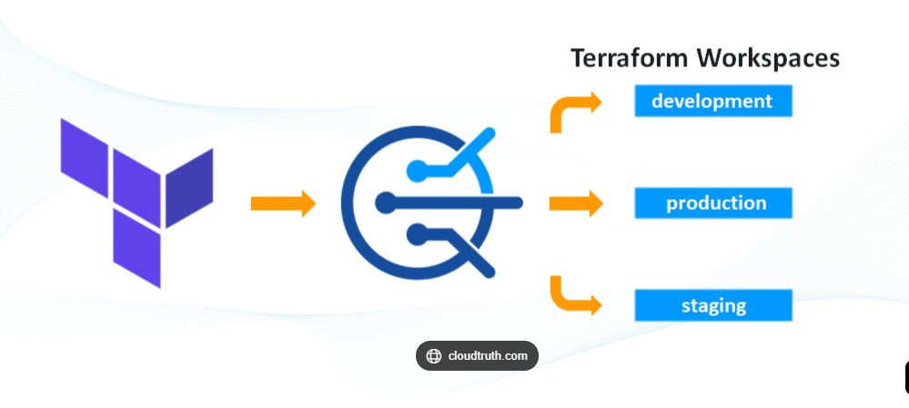
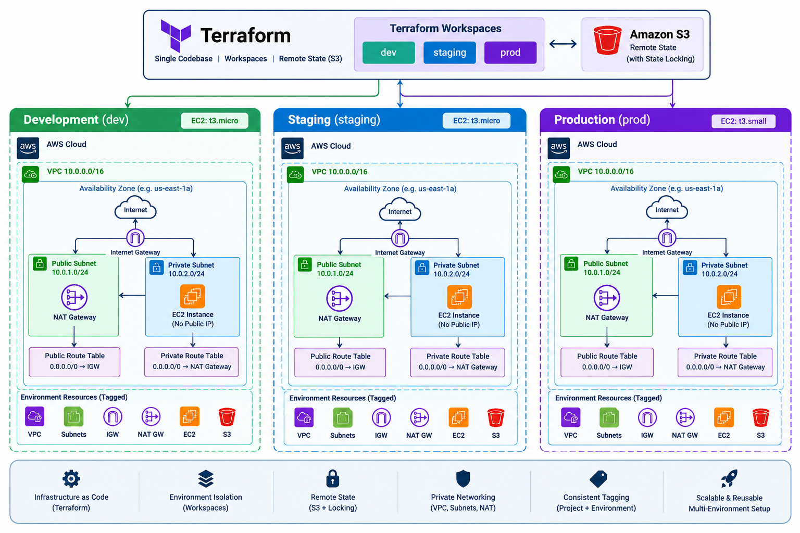
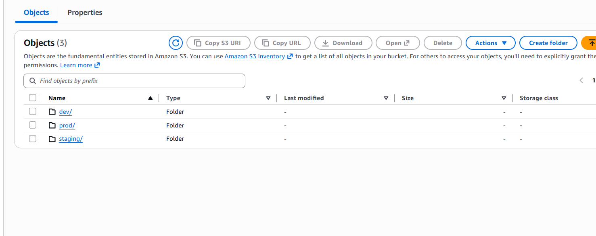
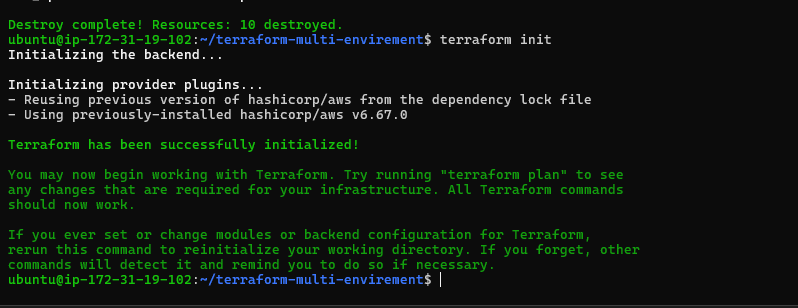
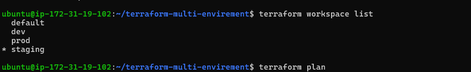

<p align="center">
  
</p>

# Multi-Environment AWS Infrastructure using Terraform Workspaces

Designed and implemented a production-style AWS infrastructure using Terraform with environment isolation, private networking, remote state management, and reusable Infrastructure as Code.

## Demo

[Add your project demo link here]

---

##  Project Summary

This project provisions AWS infrastructure for **Development, Staging, and Production** environments using a single Terraform codebase and **Terraform Workspaces**.

Each workspace maintains a separate Terraform state and provides environment-specific configuration such as EC2 instance type, resource naming, and tags.

### Production Practices Applied

- Private EC2 instances with no public IP
- Public and private subnet architecture
- NAT Gateway for outbound internet access
- Internet Gateway for public subnet connectivity
- Dynamic Amazon Linux 2023 AMI lookup
- Remote Terraform state using Amazon S3
- Native S3 state locking
- Environment-specific EC2 instance sizing
- Consistent resource tagging

> In the current implementation, each workspace provisions its own complete infrastructure stack.

---

##  Key Skills Demonstrated

- Terraform Infrastructure as Code
- AWS VPC
- AWS Networking
- Public & Private Subnets
- Internet Gateway
- NAT Gateway
- Route Tables
- Amazon EC2
- Security Groups
- Amazon S3
- Terraform Remote State
- Terraform State Locking
- Terraform Workspaces
- Terraform Data Sources
- AWS CLI
- Multi-Environment Infrastructure

---

## Problem This Solves

Managing multiple environments manually can result in duplicated configurations, inconsistent infrastructure, state conflicts, and deployment errors.

This project solves these problems by using **Terraform Workspaces** to manage multiple environments from a single reusable Terraform configuration.

```text
                         Terraform Code
                               |
              +----------------+----------------+
              |                |                |
             DEV            STAGING            PROD
              |                |                |
        Separate State   Separate State   Separate State
              |                |                |
          AWS Stack        AWS Stack        AWS Stack
```
## Architecture

<p align="center">
  
</p>


## How to Use

### 1. Prerequisites

Make sure you have:

- AWS account
- AWS CLI installed and configured
- Terraform installed
- Git installed
- IAM permissions to create the required AWS resources

Verify the installations:

```bash
aws --version
terraform version
git --version

```

## S3 Backend Setup

# 1. Create S3 bucket
aws s3api create-bucket \
  --bucket general23buucket \
  --region us-east-1

<p align="center">
  
</p>


# 1. Initialize Terraform
terraform init

<p align="center">
  
</p>

# 2. Validate configuration
terraform validate

# 3. Create workspaces
terraform workspace new dev
terraform workspace new staging
terraform workspace new prod
<p align="center">
  
</p>

# 4. Select environment
terraform workspace select dev

# 5. Review changes
terraform plan

# 6. Apply infrastructure
terraform apply

# 4. Select environment
terraform workspace select staging
terraform plan
terraform apply

# 4. Select environment
terraform workspace select prod
terraform plan
terraform apply

##  Design Principles

- **Infrastructure as Code** — AWS infrastructure is defined and managed using Terraform.
- **Environment Isolation** — Dev, Staging, and Production use separate Terraform workspaces and state.
- **Reusable Configuration** — One Terraform codebase manages all environments.
- **Remote State Management** — Terraform state is stored securely in Amazon S3.
- **State Locking** — S3 lockfile prevents conflicting Terraform operations.
- **Private-by-Default** — EC2 instances are deployed in private subnets without public IPs.
- **Controlled Internet Access** — Private instances access the internet through a NAT Gateway.
- **Dynamic AMI Selection** — The latest matching Amazon Linux AMI is selected automatically.
- **Environment-Aware Resources** — Resource names and EC2 sizes are determined by the active workspace.
- **Consistent Tagging** — Common tags identify project and environment resources.
- **Reproducibility** — The same Terraform configuration can recreate each environment consistently.
